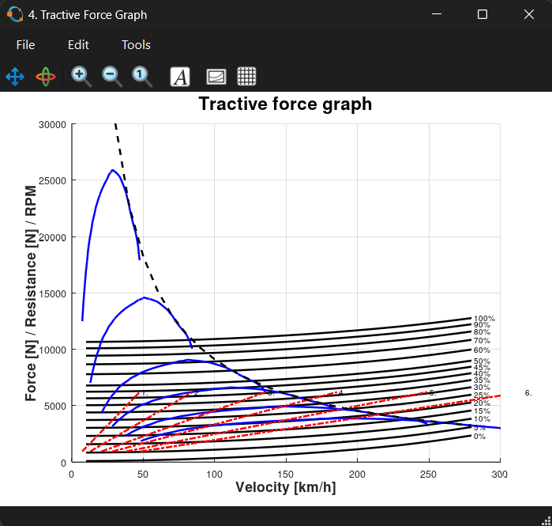

BMW i8 Vehicle Performance Analysis (GNU Octave)

This project performs a longitudinal vehicle dynamics analysis of the BMW i8 Coupe using GNU Octave.
It evaluates tractive force, resistive forces, and acceleration performance based on engineering calculations.

The project is intended for educational and engineering analysis purposes.

**Objective**

Analyze vehicle acceleration capability

Evaluate tractive force vs resistive forces

Study the influence of aerodynamic drag, rolling resistance, and road gradient

**Methods**

Tractive force calculated from engine torque, gear ratios, final drive, and efficiency

Aerodynamic drag modeled using drag coefficient and frontal area

Rolling resistance modeled using axle loads and tire parameters

Grade resistance evaluated for different road inclinations

Acceleration calculated including drivetrain inertia effects

**Vehicle Assumptions**

Vehicle: BMW i8 Coupe

Mass: 1530 kg

Max Power: 275 kW

Transmission: 6-speed gearbox

Cd: 0.26, Frontal Area: 2.13 m²

Parameters based on published specifications

**Outputs**

The script generates the following plots:

Aerodynamic drag and power vs speed

Rolling resistance force and power vs speed

Power required for different road gradients

Tractive force vs resistance (all gears + CVT comparison)

Acceleration vs speed for each gear

## Sample Results

### Figure 1 – Aerodynamic Drag Analysis

### Figure 2 – Rolling Resistance

### Figure 3 – Grade Resistance

### Figure 4 – Tractive Force vs Resistance

### Figure 5 – Acceleration Performance

**How to Run**

Install GNU Octave

Run the main script:

MainScript

All analyses execute automatically and figures open in separate windows.

**Skills Demonstrated**

Vehicle dynamics

Engineering modeling and assumptions

Numerical computation in GNU Octave

Data visualization and interpretation

**Author**

Sou Komiya
Mechanical Engineering Student – Metropolia UAS
January 2026
